<p align="center">
  
</p>

<h1 align="center">🌊 Echo Agent</h1>

<p align="center">
  <strong>Community-Driven Code Automation with AI Consensus</strong>
</p>

<p align="center">
  <a href="#-how-it-works">How It Works</a> •
  <a href="#-features">Features</a> •
  <a href="#-tech-stack">Tech Stack</a> •
  <a href="#-quick-start">Quick Start</a> •
  <a href="USER_GUIDE.md">User Guide</a> •
  <a href="#-contributing">Contributing</a>
</p>

<p align="center">
  
  
  
  
  
</p>

---

**Echo Agent** is an autonomous platform that bridges the gap between community sentiment and codebase evolution. It listens to your users wherever they speak — GitHub, Reddit, Product Hunt — analyzes their feedback using a **fully local LLM**, and automatically proposes code changes through Pull Requests. No cloud AI costs. No data leaving your machine.

---

## 🧠 How It Works

Echo Agent follows a closed-loop pipeline: **Listen → Analyze → Synthesize → Act**.

```mermaid
graph LR
    A["📢 Community Feedback<br/>(Reddit, Product Hunt, GitHub)"] --> B["🔎 Scrapers<br/>(Puppeteer)"]
    B --> C["🧠 Local LLM<br/>(Qwen 2.5 Coder 7B)"]
    C --> D["📊 Sentiment & Priority<br/>Analysis"]
    D --> E["🔗 Vector Embeddings<br/>(pgVector + MiniLM)"]
    E --> F{"⚖️ Consensus<br/>Engine"}
    F -- "Actionable" --> G["💻 Code Generation<br/>(Local LLM)"]
    F -- "Noise" --> H["🗑️ Filtered"]
    G --> I["🔀 Pull Request<br/>(GitHub API)"]
    I --> J["👀 Human Review"]
```



| Step | What Happens |
|------|-------------|
| **1. Listen** | Scrapers pull comments from Reddit threads, Product Hunt pages, and GitHub discussions into Supabase. Real-time listeners auto-trigger on new data. |
| **2. Analyze** | The local **Qwen 2.5 Coder 7B** LLM classifies each comment: sentiment score (-1 to +1), category (bug / feature / question), priority, actionable summary, and keywords. |
| **3. Synthesize** | **Sentence-transformer embeddings** (all-MiniLM-L6-v2) are stored in pgVector. Semantic search clusters similar feedback to surface true community consensus. |
| **4. Act** | When the agent detects actionable feedback, it clones the target repo, generates code patches using the LLM, creates a branch, and opens a Pull Request — all automatically. |

---

## ✨ Features

### For Developers
| Feature | Description |
|---------|-------------|
| 🎯 **Semantic Signal Detection** | Goes beyond keywords — identifies *intent*, *frustration levels*, and *priority* from raw feedback. |
| 🤖 **Autonomous Code Agent** | Watches for high-priority signals, generates code patches, and opens PRs — zero manual intervention. |
| 💬 **Multi-Platform Scrapers** | Ingest feedback from **Reddit**, **Product Hunt**, and GitHub with one click. |
| 🔍 **Semantic Search** | Natural language queries like *"What are users complaining about in the login flow?"* powered by vector similarity. |
| 📈 **AI Insights Dashboard** | Real-time sentiment trends, community intelligence reports, and priority-ranked action items. |
| 🖥️ **Live Agent Terminal** | Watch the AI agent work in real-time through a streaming terminal and execution trace view. |
| 🛡️ **Human-in-the-Loop** | No code reaches production without your approval — every PR gets human review. |
| 🔒 **100% Local Intelligence** | Powered entirely by Qwen 2.5 via `llama-cpp-python` — zero cloud LLM costs, zero data leaks. |

### For Businesses
| Feature | Description |
|---------|-------------|
| 📊 **Business Analytics Portal** | Track developer reach, community sentiment, and engagement metrics. |
| 🔐 **Google OAuth Login** | Separate business login flow with Google, tailored for non-developer stakeholders. |
| 📋 **Campaign & Sentiment Tracking** | Monitor developer sentiment across campaigns and product launches. |

### UI & Design
- **Brutalist Design Language** — Bold, high-contrast interface with thick borders, hard shadows, and uppercase typography.
- **Fully Responsive** — Works on desktop and mobile.
- **Dark Mode Login** — Dual-mode login page with developer (GitHub) and business (Google) toggles.

---

## 🛠️ Tech Stack

### Architecture Overview


### Stack Details

| Layer | Technology | Purpose |
|-------|-----------|---------|
| **Framework** | Next.js 14 (App Router) | Server components, server actions, SSR |
| **Styling** | Tailwind CSS + Shadcn/ui + Radix UI | Brutalist component system |
| **Charts** | Recharts | Dashboard analytics visualizations |
| **Auth** | Supabase Auth (GitHub OAuth + Google OAuth) | Dual-mode authentication |
| **Database** | Supabase (PostgreSQL) | Posts, comments, profiles, agent tasks, tokens |
| **Vector Search** | pgVector (384-dim) | Semantic similarity search for feedback clustering |
| **Embeddings** | Sentence Transformers (all-MiniLM-L6-v2) | Local text-to-vector conversion |
| **LLM** | Qwen 2.5 Coder 7B Instruct (GGUF, Q5_K_M) | Comment analysis, report generation, code generation |
| **LLM Runtime** | llama-cpp-python | CPU/GPU inference for GGUF models |
| **Rate Limiting** | Upstash Redis | API rate limiting and throttling |
| **Scraping** | Puppeteer | Headless browser scraping for Reddit & Product Hunt |
| **Backend API** | FastAPI + Uvicorn | LLM inference, embedding generation, realtime processing |
| **VCS Integration** | GitHub REST API | Repo tree access, branch creation, PR automation |

---

## ⚙️ Quick Start

### Prerequisites

| Requirement | Version | Notes |
|-------------|---------|-------|
| **Node.js** | 18+ | Required for Next.js frontend |
| **Python** | 3.10+ | Required for FastAPI backend |
| **Supabase Account** | — | Free tier works. [Sign up here](https://supabase.com/) |
| **Upstash Redis** | — | Free tier works. [Sign up here](https://upstash.com/) |
| **GitHub OAuth App** | — | For developer login. [Create one here](https://github.com/settings/developers) |
| **Google OAuth** | — | For business login. [Google Cloud Console](https://console.cloud.google.com/) |
| **GPU (Optional)** | 6GB+ VRAM | Dramatically speeds up LLM inference |

### 1. Clone the Repository

```bash
git clone https://github.com/VaradSinghal/echo-v2.git
cd echo-v2
```

### 2. Install Frontend Dependencies

```bash
npm install
```

### 3. Configure Environment Variables

Create a `.env.local` file in the project root:

```env
# Supabase
NEXT_PUBLIC_SUPABASE_URL=your_supabase_project_url
NEXT_PUBLIC_SUPABASE_ANON_KEY=your_supabase_anon_key
SUPABASE_SERVICE_ROLE_KEY=your_supabase_service_role_key

# Local Backend
LOCAL_EMBEDDING_URL=http://localhost:8000/embed

# Upstash Redis (Rate Limiting)
UPSTASH_REDIS_REST_URL=your_upstash_redis_url
UPSTASH_REDIS_REST_TOKEN=your_upstash_redis_token
```

Create a `.env` file inside `python_backend/`:

```env
SUPABASE_URL=your_supabase_project_url
SUPABASE_KEY=your_supabase_service_role_key
FRONTEND_URL=http://localhost:3000
```

### 4. Set Up the Database

Apply all migration files from `supabase/migrations/` to your Supabase project in order. These create the schema for:

| Table | Purpose |
|-------|---------|
| `profiles` | User profiles synced from OAuth |
| `github_tokens` | GitHub access tokens (per user) |
| `posts` | Scraped threads / topics |
| `comments` | Individual feedback entries |
| `comment_analysis` | LLM sentiment/priority analysis results |
| `agent_tasks` | Code generation task tracking |
| `comment_embeddings` | pgVector embeddings (384-dim) |

> [!TIP]
> You can paste each `.sql` file into the Supabase SQL Editor in your project dashboard, or use the Supabase CLI:
> ```bash
> supabase db push
> ```

### 5. Set Up the Python Backend

```bash
cd python_backend

# Create and activate a virtual environment
python -m venv venv
# Windows:
venv\Scripts\activate
# macOS/Linux:
source venv/bin/activate

# Install dependencies
pip install -r requirements.txt
```

### 6. Download the LLM Model

```bash
python download_model.py
```

This downloads **Qwen 2.5 Coder 7B Instruct** (Q5_K_M quantization, ~5GB) from Hugging Face into the `python_backend/models/` directory.

> [!NOTE]
> First download may take 10-30 minutes depending on your connection. The model file is approximately 5GB.

### 7. Start the Backend

```bash
python main.py
```

The FastAPI server starts on `http://localhost:8000`. It will:
- Load the Qwen 2.5 model into memory
- Load the sentence-transformer embedding model
- Connect to Supabase and start listening for real-time events

### 8. Start the Frontend

Open a new terminal in the project root:

```bash
npm run dev
```

The Next.js app starts on `http://localhost:3000`.

---

## 📁 Project Structure

```
echo-v2/
├── app/                          # Next.js App Router
│   ├── page.tsx                  # Landing page
│   ├── login/                    # Dual-mode login (GitHub / Google)
│   ├── auth/                     # OAuth callback handlers
│   ├── dashboard/                # Protected dashboard routes
│   │   ├── feed/                 # Community feed viewer
│   │   ├── insights/             # AI-powered analytics
│   │   ├── agent/                # Echo Agent control center
│   │   ├── reddit/               # Reddit scraper interface
│   │   ├── product-hunt/         # Product Hunt scraper
│   │   ├── profile/              # User profile
│   │   └── subscription/         # Plans & marketplace
│   ├── business/                 # Business analytics portal
│   ├── actions/                  # Server actions
│   │   ├── agent.ts              # Agent triggers, monitoring, search
│   │   ├── scraper.ts            # Reddit & PH scraping actions
│   │   └── feed.ts               # Feed data actions
│   └── api/                      # API routes (GitHub callback, agent)
│
├── components/                   # React components
│   ├── agent/                    # Agent terminal, monitoring, search
│   ├── dashboard/                # Sidebar, local insights
│   ├── landing/                  # Hero, features, nav, footer
│   ├── feed/                     # Community feed components
│   ├── reddit/                   # Reddit scraper UI
│   ├── product-hunt/             # Product Hunt scraper UI
│   └── ui/                       # Shadcn/Radix primitives
│
├── lib/                          # Shared libraries
│   ├── github.ts                 # GitHubService (tree, PR creation)
│   ├── redis.ts                  # Upstash rate limiter
│   └── scraper/                  # Reddit & PH scraping logic
│
├── python_backend/               # FastAPI backend
│   ├── main.py                   # API server + realtime listener
│   ├── llm_service.py            # Qwen 2.5 LLM wrapper
│   ├── download_model.py         # Model downloader script
│   ├── requirements.txt          # Python dependencies
│   └── models/                   # Downloaded GGUF models
│
├── supabase/
│   └── migrations/               # 16 SQL migration files
│
├── utils/                        # Supabase client utilities
│   └── supabase/                 # Server, client, middleware helpers
│
└── public/                       # Static assets (logos, SVGs)
```

---

## 🔌 API Endpoints (Python Backend)

The FastAPI backend exposes these endpoints on `http://localhost:8000`:

| Method | Endpoint | Description |
|--------|----------|-------------|
| `GET` | `/health` | Health check — confirms LLM and embeddings are loaded |
| `POST` | `/embed` | Generate 384-dim embedding for a text string |
| `POST` | `/analyze/{comment_id}` | Trigger sentiment analysis for a specific comment |
| `POST` | `/report` | Generate a community intelligence report from comment IDs |
| `POST` | `/top-comment` | Get the highest-priority comment from a set |
| `POST` | `/generate` | Clone a repo, generate code patches, and optionally create a PR |
| `POST` | `/reinitialize-llm` | Force-reload the LLM model |
| `GET` | `/logs` | Fetch the last 100 lines of backend logs |
| `POST` | `/v1/chat/completions` | OpenAI-compatible chat completions endpoint |

---

## 🤝 Contributing

We welcome contributions! Here's how to get started:

1. **Fork** the repository
2. **Create** your feature branch
   ```bash
   git checkout -b feature/amazing-feature
   ```
3. **Commit** your changes
   ```bash
   git commit -m "feat: add amazing feature"
   ```
4. **Push** to your branch
   ```bash
   git push origin feature/amazing-feature
   ```
5. **Open** a Pull Request

### Development Tips

- Run `npm run lint` to check for linting errors
- The backend auto-reloads on file changes with `uvicorn --reload`
- Use the `/health` endpoint to verify the backend is running correctly

---

## 📄 License

Distributed under the **MIT License**. See `LICENSE` for more information.

---

<p align="center">
  <sub>Built with ❤️ by <a href="https://github.com/VaradSinghal">Varad Singhal</a></sub>
</p>
