# 🌊 Echo Agent
### Community-Driven Code Automation with AI consensus.

[](https://nextjs.org/)
[](https://supabase.com/)
[](https://github.com/QwenLM/Qwen2.5)
[](https://tailwindcss.com/)

**Echo Agent** is an autonomous platform that bridges the gap between community sentiment and codebase evolution. It listens to your users where they speak (GitHub, Socials), analyzes their needs using LLMs, and automatically proposes code changes through Pull Requests.

---

## 🚀 How It Works

Echo Agent follows a simple yet powerful pipeline to transform feedback into code:

```mermaid
graph TD
    A["📢 Community Feedback"] --> B["🧠 Local LLM Processor"]
    B --> C["🔍 Vector Search (pgVector)"]
    C --> D{"⚖️ Consensus Engine"}
    D -- "Actionable" --> E["💻 Echo Agent (Coding)"]
    D -- "Noise" --> F["🗑️ Filtered"]
    E --> G["🔀 Pull Request"]
    G --> H["👀 Human Review"]
```



1.  **Listen**: Monitors GitHub discussions, comments, and linked social posts.
2.  **Analyze**: Uses a **Local Qwen 2.5 LLM** to classify sentiment, identify bugs/features, and extract technical requirements.
3.  **Synthesize**: Clusters similar feedback using **Local Embeddings** (all-MiniLM-L6-v2) to find community consensus.
4.  **Act**: The AI agent writes code using the Local LLM, creates a branch, and opens a PR with a detailed explanation of *why* the change was made.

---

## ✨ Core Features

-   **🎯 Semantic Signal Detection**: Goes beyond keyword matching. Identifies *intent* and *frustration* levels.
-   **📈 Real-time Analytics**: A "Mission Control" dashboard showing sentiment trends and active signals.
-   **💻 Agent Terminal**: Watch the AI work in real-time through a streaming terminal interface.
-   **🛡️ Human-in-the-Loop**: No code reaches production without human approval.
-   **🔒 100% Local Intelligence**: Powered by Qwen 2.5 for privacy and zero cloud LLM costs.
-   **🌙 Modern Brutalist UI**: Sleek, high-contrast interface designed for power users.

---

## 🛠️ Tech Stack

### Frontend & UI
- **Framework**: Next.js 14 (App Router)
- **Styling**: Tailwind CSS
- **Components**: Shadcn UI & Radix UI
- **Charts**: Recharts

### Backend & AI
- **Database**: Supabase (PostgreSQL)
- **Vector Search**: pgVector
- **Intelligence**: Local LLM (Qwen 2.5 Coder 7B)
- **Rate Limiting**: Upstash Redis

---

## ⚙️ Quick Start

### 1. Requirements
Ensure you have Node.js 18+, a Supabase account, and the local Python backend running for LLM services.

### 2. Installation
```bash
git clone https://github.com/VaradSinghal/echo-v2.git
cd echo-v2
npm install
```

### 3. Environment Setup
Create a `.env.local` file:
```env
NEXT_PUBLIC_SUPABASE_URL=your_supabase_url
NEXT_PUBLIC_SUPABASE_ANON_KEY=your_supabase_anon_key
SUPABASE_SERVICE_ROLE_KEY=your_service_role_key

# Local LLM Backend (Python)
LOCAL_EMBEDDING_URL=http://localhost:8000/embed

UPSTASH_REDIS_REST_URL=your_redis_url
UPSTASH_REDIS_REST_TOKEN=your_redis_token
```

### 4. Database Setup
Apply the migrations in `supabase/migrations/` to your Supabase project. This sets up the necessary schemas for signals, tasks, and vector storage.

### 5. Run it
```bash
npm run dev
```

---

## 📖 Documentation

*   [User Guide](file:///e:/Projects/echo-v2/USER_GUIDE.md) - Learn how to connect your first repo.
*   [API Documentation] - (Coming Soon)

---

## 🤝 Contributing

We welcome contributions! Please see our contributing guidelines for how to get started.

1. Fork the Project
2. Create your Feature Branch (`git checkout -b feature/AmazingFeature`)
3. Commit your Changes (`git commit -m 'Add some AmazingFeature'`)
4. Push to the Branch (`git push origin feature/AmazingFeature`)
5. Open a Pull Request

---

## 📄 License

Distributed under the MIT License. See `LICENSE` for more information.
