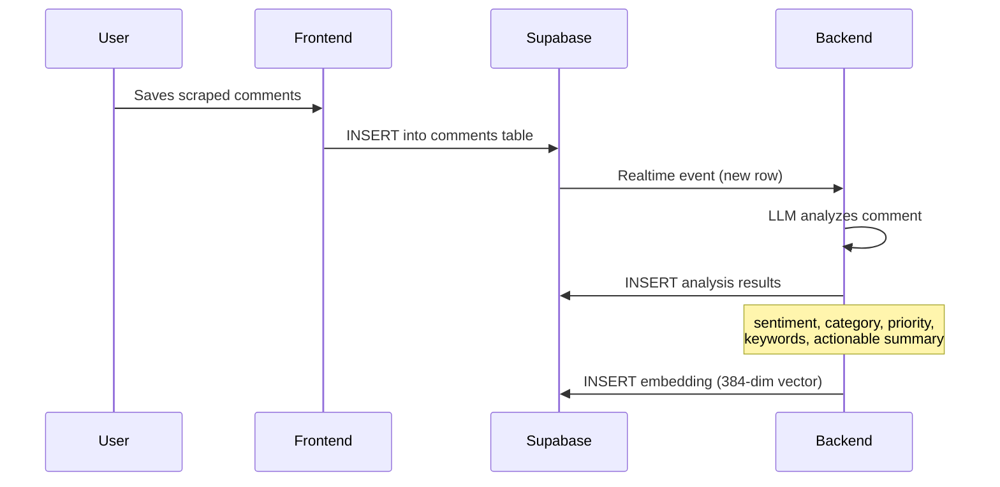
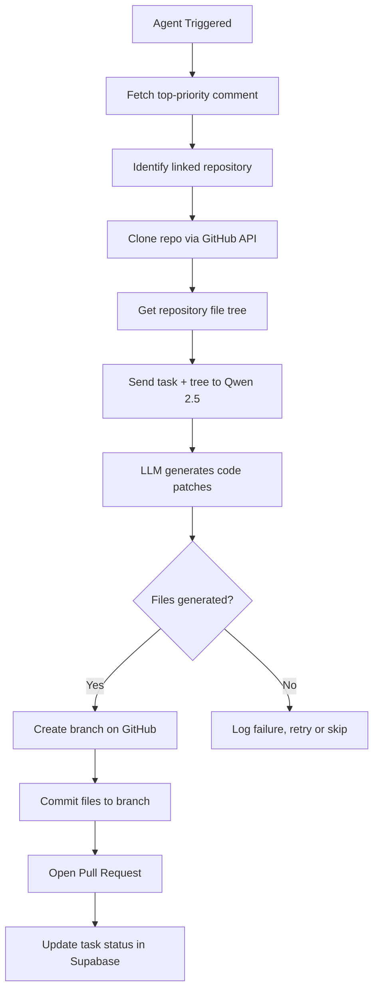

<p align="center">
  
</p>

<h1 align="center">Echo Agent — User Guide</h1>

<p align="center">
  <em>A complete guide to using the Echo Agent platform, from first login to automated Pull Requests.</em>
</p>

<p align="center">
  <a href="#-getting-started">Getting Started</a> •
  <a href="#-dashboard-overview">Dashboard</a> •
  <a href="#-scraping-feedback">Scraping</a> •
  <a href="#-echo-agent">Agent</a> •
  <a href="#-ai-insights">Insights</a> •
  <a href="#-business-portal">Business Portal</a> •
  <a href="#-troubleshooting">Troubleshooting</a>
</p>

---

## 🚀 Getting Started

### Step 1: Create Your Account

Echo Agent supports **two login modes** — choose the one that matches your role:

| Mode | OAuth Provider | Best For |
|------|---------------|----------|
| **Developer** | GitHub | Engineers who want to monitor repos, run the agent, and auto-generate PRs |
| **Business** | Google | Product managers and business stakeholders who want sentiment analytics |

1. Navigate to `http://localhost:3000` (or your deployed URL).
2. Click **Login** in the navigation bar.
3. On the login page, toggle between **Developer** and **Business** at the top.
4. Click the login button and authorize with GitHub or Google.

> [!TIP]
> **Developer login** is required if you want the agent to create Pull Requests on your repositories. The GitHub OAuth grants the necessary repo permissions.

### Step 2: Explore the Dashboard

After logging in, you'll land on the **Dashboard**. Use the sidebar to navigate between sections:

| Sidebar Item | What It Does |
|-------------|--------------|
| **Community Feed** | View all scraped feedback from Reddit, Product Hunt, and GitHub |
| **AI Insights** | View AI-generated sentiment analysis and intelligence reports |
| **Echo Agent** | Monitor repos, run the agent, watch it generate code in real-time |
| **Reddit** | Scrape and import Reddit threads |
| **Profile** | Manage your account settings |

---

## 📊 Dashboard Overview

The dashboard is your command center. Here's what each section does in detail.

### Community Feed

The **Community Feed** page (`/dashboard/feed`) displays all ingested feedback in a unified timeline.

- Each entry shows the comment text, source platform, and any analysis tags.
- Feed data is pulled from your Supabase `comments` table.
- New data appears in real-time as comments are added via scrapers or realtime listeners.

### Subscription & Plans

Access via the **Upgrade to Pro** button in the top bar or the subscription page. Plans include:

| Plan | Features |
|------|----------|
| **Free** | 1 repo, basic analytics, limited agent runs |
| **Pro** | Unlimited repos, priority agent, advanced insights |
| **Teams** | Multi-user, shared dashboards, enterprise support |

---

## 🕷️ Scraping Feedback

Echo Agent lets you pull feedback from multiple platforms into your database with one click.

### Reddit Scraper

1. Go to **Reddit** in the sidebar.
2. Paste a full Reddit thread URL (e.g., `https://www.reddit.com/r/webdev/comments/abc123/...`).
3. Click **Scrape**.
4. The scraper uses Puppeteer to load the page and extract all comments (author, content, upvotes).
5. **Preview** the comments in the table below.
6. Optionally link a **GitHub repository** so the agent knows which codebase this feedback relates to.
7. Click **Save to Database** to persist the comments to Supabase.

> [!NOTE]
> Reddit scraping uses a headless browser (Puppeteer). Make sure Chromium dependencies are installed on your system. On first run, Puppeteer will auto-download the browser binary.

### Product Hunt Scraper

1. Go to **Product Hunt** in the dashboard (if available in sidebar, or navigate to `/dashboard/product-hunt`).
2. Paste a Product Hunt product URL.
3. Click **Scrape** to extract comments.
4. Preview and **Save** to database.

### What Happens After Saving

Once comments are saved to Supabase:



The Python backend's **Realtime Listener** automatically picks up new comments and:
1. Runs **sentiment analysis** via the local LLM
2. Generates a **384-dimensional embedding** for semantic search
3. Stores both back into Supabase

---

## 🤖 Echo Agent

The Echo Agent is the core automation engine. It takes high-priority feedback, generates code patches, and opens Pull Requests.

### Agent Control Center

Navigate to **Echo Agent** (`/dashboard/agent`) to access:

| Section | Description |
|---------|-------------|
| **Monitoring Panel** | See which posts/repos are being tracked. Toggle monitoring on/off. |
| **Agent Terminal** | Live streaming view of the agent's work — see logs as it clones, generates, and pushes code. |
| **Work History** | Timeline of all past agent runs with status, duration, and links to PRs. |
| **Code Diff Preview** | View the generated file changes before or after a PR is created. |
| **Execution Trace** | Step-by-step trace of the agent's decision process. |

### Running the Agent

There are two ways the agent runs:

#### Automatic (Realtime Trigger)
When new comments are saved and analyzed, database triggers can automatically start an agent run. The backend's realtime listener processes new data and decides when to act.

#### Manual Trigger
1. On the **Echo Agent** page, ensure at least one post is being monitored (toggle is active).
2. Click **Run Agent** or the equivalent trigger button.
3. Watch the terminal for real-time logs.

### What the Agent Does (Step by Step)



1. **Fetches** the highest-priority unresolved comment from the monitored post.
2. **Clones** the linked GitHub repository.
3. **Reads** the file tree to give the LLM context.
4. **Prompts** the Qwen 2.5 model with the task description and repo structure.
5. **Generates** code patches (JSON format: file paths + content).
6. **Creates** a new branch (e.g., `echo-agent/fix-login-bug`).
7. **Commits** the generated files.
8. **Opens** a Pull Request with a detailed description explaining *why* the change was made.

> [!IMPORTANT]
> The agent **never merges** code automatically. Every PR requires your manual review and approval on GitHub.

### Monitoring Repositories

From the Monitoring Panel:

- **Enable monitoring** — Toggle the switch next to a post to start tracking its linked repository.
- **Link a repo** — When saving scraped comments, provide the GitHub repository URL. The agent uses this to know where to push code.
- **Disable monitoring** — Toggle off to stop the agent from running on that post's feedback.

---

## 🧠 AI Insights

Navigate to **AI Insights** (`/dashboard/insights`) for intelligent analytics.

### Intelligence Reports

The AI generates structured reports from your feedback data:

| Report Section | What It Contains |
|---------------|-----------------|
| **📊 Executive Summary** | High-level overview of community sentiment |
| **📈 Sentiment Pulse** | Positive/negative/neutral breakdown |
| **🔥 High-Resonance Issues** | Issues with the most community momentum |
| **🚀 Growth Opportunities** | Feature requests and improvement suggestions |
| **🛠️ Strategic Roadmap** | Recommended action items prioritized by impact |

### Semantic Search

Use the search bar on the agent page to find feedback by meaning, not keywords:

**Example queries:**
- *"What are people frustrated about with authentication?"*
- *"Show me suggestions for improving the onboarding flow"*
- *"Find bugs related to the payment system"*

The search works by:
1. Converting your query into a 384-dim embedding.
2. Running a cosine similarity search against all stored comment embeddings in pgVector.
3. Returning the most semantically similar feedback, ranked by relevance.

---

## 🏢 Business Portal

Business users (signed in via Google) have access to the **Business Overview** page at `/business`.

### Analytics Dashboard

| Metric | Description |
|--------|-------------|
| **Developer Reach** | Total developer engagement across your products |
| **Community Sentiment** | Aggregate sentiment score from all feedback |
| **Signal Volume** | Total feedback signals processed |
| **Engagement Rate** | Active discussion rate across tracked threads |

### Features
- **Monthly Trend Charts** — Visualize sentiment and engagement over 12 months.
- **Top Repositories** — See which repos have the highest community sentiment.
- **Campaign Tracking** — Track developer sentiment across product launches.

---

## ⚙️ Advanced Configuration

### Backend Environment Variables

| Variable | Description | Default |
|----------|-------------|---------|
| `SUPABASE_URL` | Your Supabase project URL | — |
| `SUPABASE_KEY` | Supabase service role key | — |
| `FRONTEND_URL` | Frontend origin (for CORS) | `http://localhost:3000` |

### Frontend Environment Variables

| Variable | Description |
|----------|-------------|
| `NEXT_PUBLIC_SUPABASE_URL` | Public Supabase URL (exposed to browser) |
| `NEXT_PUBLIC_SUPABASE_ANON_KEY` | Public Supabase anonymous key |
| `SUPABASE_SERVICE_ROLE_KEY` | Server-side service role key |
| `LOCAL_EMBEDDING_URL` | Backend embedding endpoint |
| `UPSTASH_REDIS_REST_URL` | Redis URL for rate limiting |
| `UPSTASH_REDIS_REST_TOKEN` | Redis auth token |

### LLM Model Configuration

The default model is **Qwen 2.5 Coder 7B Instruct** (Q5_K_M quantization). To change:

1. Edit `python_backend/download_model.py`:
   ```python
   MODEL_REPO = "Qwen/Qwen2.5-Coder-7B-Instruct-GGUF"
   ALLOW_PATTERNS = ["*qwen2.5-coder-7b-instruct-q5_k_m*.gguf"]
   ```
2. Re-run `python download_model.py`.
3. Restart the backend.

**GPU Acceleration:**
The backend offloads 32 layers to GPU by default (`n_gpu_layers=32` in `llm_service.py`). Adjust this value based on your VRAM:

| VRAM | Recommended `n_gpu_layers` |
|------|---------------------------|
| No GPU | 0 |
| 4 GB | 16 |
| 6 GB | 32 |
| 8+ GB | 40+ |

---

## 🔧 Troubleshooting

### Common Issues

<details>
<summary><strong>❌ "LLM not loaded" errors in the terminal</strong></summary>

- Ensure the model file exists in `python_backend/models/`.
- Run `python download_model.py` if the download didn't complete.
- Check that `llama-cpp-python` was installed correctly. On Windows, you may need to install the MSVC build tools.
</details>

<details>
<summary><strong>❌ Puppeteer / Chromium errors during scraping</strong></summary>

- Run `npx puppeteer browsers install chrome` to manually install Chromium.
- On Linux, install system dependencies: `sudo apt install -y libatk-bridge2.0-0 libx11-xcb1 libxcomposite1 libxdamage1`.
</details>

<details>
<summary><strong>❌ "GitHub access token not found" when running the agent</strong></summary>

- Make sure you logged in with **GitHub** (developer mode), not Google.
- The OAuth callback stores your GitHub token in the `github_tokens` table.
- Check that the Supabase `github_tokens` table has a row for your user.
</details>

<details>
<summary><strong>❌ Supabase realtime events not triggering</strong></summary>

- Ensure the database triggers are set up (run migration `20240204_realtime_triggers.sql`).
- Check that the backend's realtime listener is running (look for "Subscribed to realtime" in the backend logs).
- Verify the `SUPABASE_KEY` in the backend `.env` is the **service role key**, not the anon key.
</details>

<details>
<summary><strong>❌ Backend won't start / port 8000 in use</strong></summary>

- Kill any existing process on port 8000:
  - **Windows:** `netstat -ano | findstr :8000` then `taskkill /PID <pid> /F`
  - **macOS/Linux:** `lsof -i :8000` then `kill <pid>`
- Restart with `python main.py`.
</details>

<details>
<summary><strong>❌ Rate limiting errors</strong></summary>

- Check your Upstash Redis credentials in `.env.local`.
- Verify the Redis instance is active at [console.upstash.com](https://console.upstash.com).
</details>

### Useful Commands

| Command | Purpose |
|---------|---------|
| `npm run dev` | Start the Next.js frontend (port 3000) |
| `npm run build` | Build production bundle |
| `npm run lint` | Run ESLint checks |
| `python main.py` | Start the Python backend (port 8000) |
| `python download_model.py` | Download the Qwen 2.5 GGUF model |
| `curl http://localhost:8000/health` | Check backend health status |
| `curl http://localhost:8000/logs` | View recent backend logs |

### Health Check

To verify everything is running correctly:

```bash
# 1. Check backend health
curl http://localhost:8000/health

# Expected response:
# {"status": "ok", "llm_loaded": true, "embedding_model": "loaded"}

# 2. Check frontend
# Navigate to http://localhost:3000 in your browser

# 3. Test embedding generation
curl -X POST http://localhost:8000/embed \
  -H "Content-Type: application/json" \
  -d '{"text": "test embedding"}'

# Expected: {"embedding": [0.0123, -0.0456, ...]}  (384 float values)
```

---

## 📝 Glossary

| Term | Definition |
|------|-----------|
| **Signal** | A piece of community feedback (comment, post, review) |
| **Consensus** | When multiple signals point to the same issue or request |
| **Agent Task** | A code generation job triggered by actionable feedback |
| **Embedding** | A 384-dimensional vector representing the semantic meaning of text |
| **Sentiment Score** | A value from -1.0 (very negative) to +1.0 (very positive) |
| **Priority Score** | A value from 0.0 (low) to 1.0 (high) based on urgency and impact |
| **GGUF** | A model format for quantized LLMs, used by llama-cpp-python |

---

<p align="center">
  <sub>Need help? Open an issue on <a href="https://github.com/VaradSinghal/echo-v2/issues">GitHub</a>.</sub>
</p>
